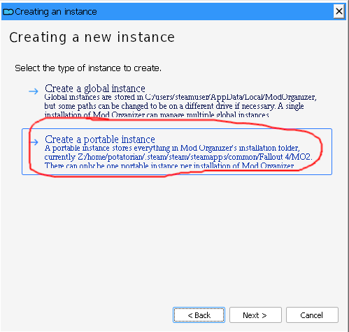
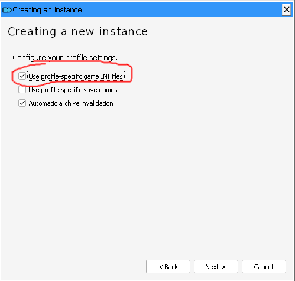
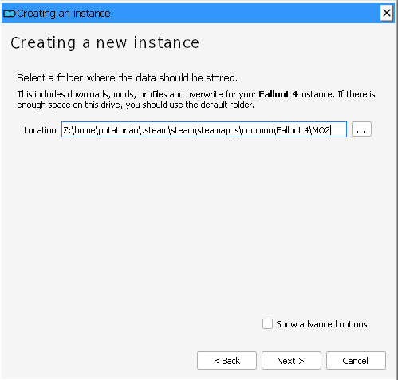
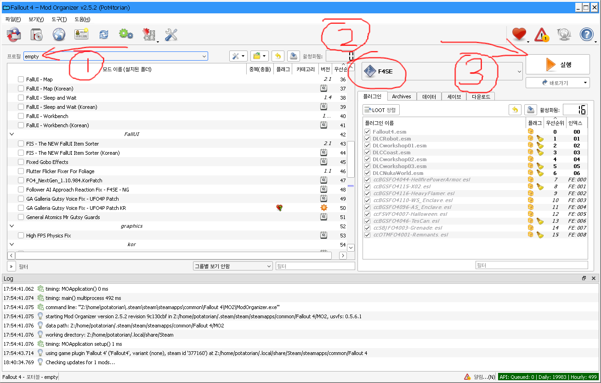
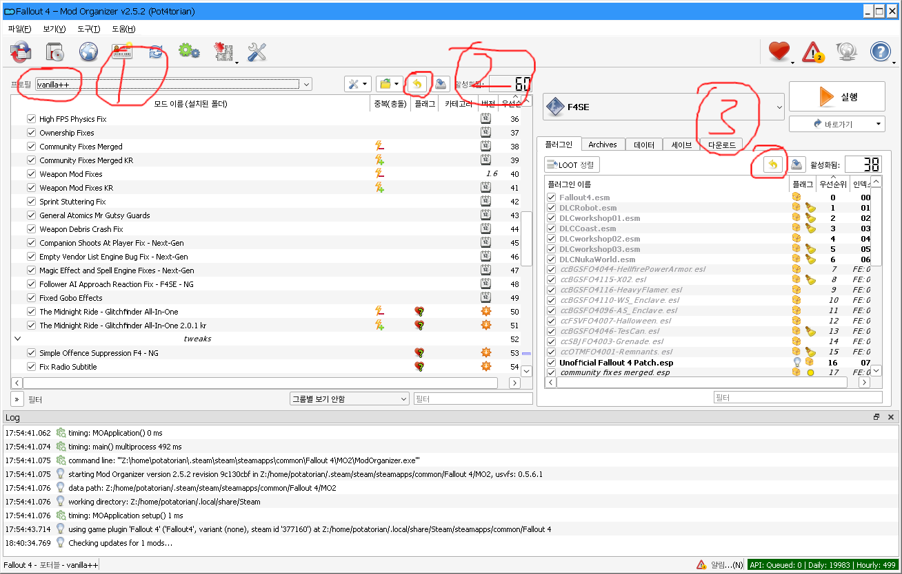
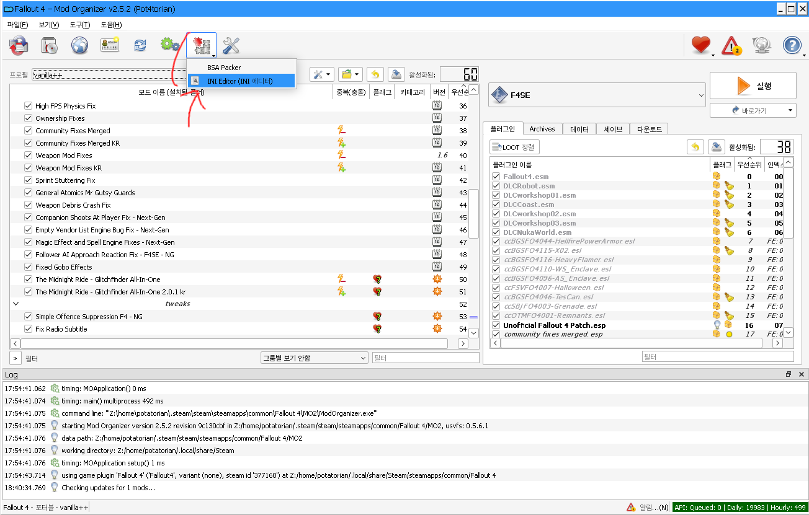
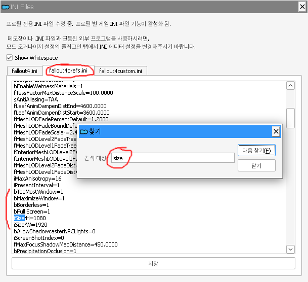
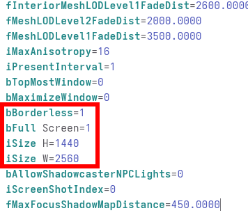
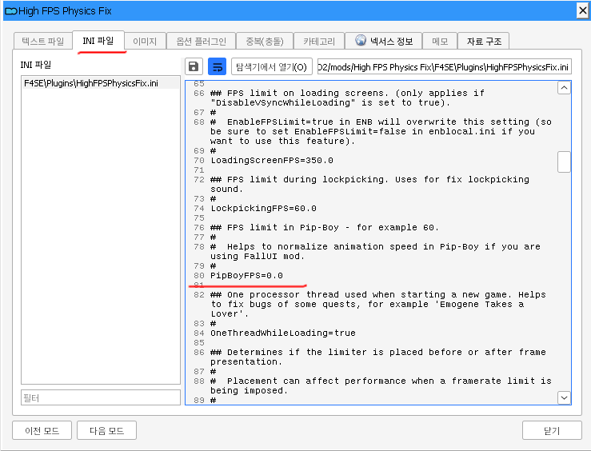

# README 읽어주세요  
Fallout 4 GOTY 에디션 최신 버전(v1.10.984.0.0) 기준으로 작성했습니다.  
버전 다운그레이드가 필요 없는 기초적인 mod들만 포함했습니다.  

[다운로드 링크](https://drive.google.com/drive/folders/1M2BVgm2ltEnazZjBx_luif4oiNrieI35?usp=sharing)  
(필요하신분 있으시면 요청 넣으세요 열어드릴게요)  

### 외부 프로그램 버전  
Mod Organizer2 - v2.5.5  
f4se - build: 0.7.2  

## 종속성
혹시 없다고 오류 뜨면 깔면 됩니다.  

들어가서 중간에 x64 버전 설치  
[Visual C++ Redistributable for Visual Studio 2015-2022](https://learn.microsoft.com/en-us/cpp/windows/latest-supported-vc-redist?view=msvc-170)  

## 백업 (선택)  
`Fallout 4/Data/Video` 폴더는 인트로, 엔딩 영상 번역본입니다.  
기존 영상보다 화질이 낮으니 화질 좋은 영상으로 보시려면 이건 빼세요.  
덮어씌울 경우 기존 영상은 백업해두세요.  

## 설치 방법  
받은 `Fallout 4` 폴더를 `.../{스팀설치디렉토리}/Fallout 4` 게임 설치 폴더에 덮어씌우면 됩니다.  

번역된 인트로랑 아웃트로는 `Video` 폴더에 있습니다. 적용하고 싶으시면 `Fallout 4/Data/Video` 폴더에 덮어씌우시면 됩니다.(없으면 용량없어서 뺀거임)  

## 초기 설정  
- 스팀에서 게임 최초 한 번 실행  

### MO2 초기 설정  
- `.../Fallout 4/MO2/ModOrganizer.exe` 최초 실행, 스샷대로 따라하면 됩니다.  

- 게임 경로는 스팀 게임 설치 폴더에 있는 `Fallout 4`로  

  
  
(위에 두개 체크 안해도 어차피 프로파일에 셋팅 돼있긴 함)  
 

- MO2 경로 지정해주는건 안건들고 그대로 next  

  
이 이후 뜨는 창은 다 그대로 넘기기.  
 

- empty 프로파일 선택 후 `f4se`로 실행, 정상실행 확인 후 종료 (정상적으로 실행 되는지 확인)  
-> 실패하면 [해결 방법](#f4se로-실행했는데-까만-창이-떴다가-바로-꺼질-경우)  
-> 성공하면 MO2 한번 껐다가 다시 실행해주세요  

  
 

- profile을 `empty`에서 `vanilla++`로 변경, 왼쪽 모드 목록과 오른쪽 모드 목록 다 백업 불러오기 클릭  

  
 

- 해상도가 1920x1080가 아니라면 맞게 수정해주세요.  
테두리 없는 창모드 하려면 `bFull Screen` 값을 0으로 바꾸면 됨  

  
  
  

## 인게임 설정  
FOV, HUD 등 다양한 인게임 모드 설정은 ESC -> `MCM Config`에 있습니다.  

여기까지 설정 끝 입니다.  

## 에러가 생길 경우  
### profile을 vanilla++로 변경했는데 한글이 안나오고 작은 창화면으로 실행될 경우  
MO2 껐다가 다시 실행하세요  

### `f4se`로 실행했는데 까만 창이 떴다가 바로 꺼질 경우  
하나씩 해보세요  

- 컴퓨터에 `Fasoo DRM`이란 프로그램이 설치되어 있는지 확인, 삭제  

- MO2에서 `Fix Radio Subtitle` 또는 `High FPS Physics Fix` 체크 해제하기  

첫번째는 라디오 자막 모드, 두번째는 로딩속도 개선이랑 fps 높을 때 발생하는 문제 고치는 모드  

- windows defender에서 `Fallout 4` 폴더 검사 중지  

## 버그 관련  
### 지형 텍스쳐 깨짐  
가장 아래에 있는 `PRP` 세퍼레이터 안에 있는 모드 두개 모두 끄기 (텍스쳐 수정, 최적화 모드)  

### 게임 처음에 로딩이 너무 길 경우  
MO2에서 `Far Object LOD Improvement Project`, `Pregenerated Object LOD` 체크 해제  
먼 거리에 있는 물체들의 퀄리티가 많이 떨어집니다 (LOD)  

### 너무 자주 튕길 경우  
아래를 하나씩 적용해보시면 됩니다  

#### 모드 해제  
- `3rd Person Behavior Fixes` - 3인칭 애니메이션 수정 모드  

- `Fix Radio Subtitle` - 라디오 자막 모드, or `High FPS Physics Fix` - 60fps 이상 물리 버그 수정 모드  
이건 둘 중 하나만, high fps는 해제하면 로딩 매우 느려질 수 있음  

### 너무 어두워서 불편할 경우  
~MO2에서 `Lightweight Lighting` 모드 체크 해제 하세요~  
기본 설정으로 꺼놨습니다  

### pip-boy 애니메이션이 미친듯이 빨라요  
  
MO2에서 `High FPS Physics Fix` 더블클릭해서 80번 줄  `PipBoyFPS` 값을 60.0으로 바꾸기 (안거슬리면 살짝 더 올려도 괜찮을듯?)  

